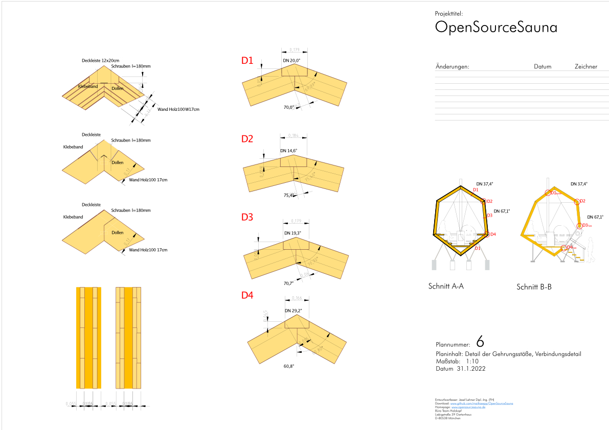

# Pläne
Hier sind Pläne aller Art zu finden.  
Gelayoutete Pläne liegen als PDF vor. 
Die Zeichnungsdateien sind als DXF/DWG gespeichert.

Folgende Pläne sind hier zu finden:
- Entwurfspläne 1:100
- Eingabeplan 1:100
- Werkpläne 1:50
- Detailpläne 1:1 bis 1:10
- Positionsplan (für die Statik) 

# CAD Programm
Zur Verwendung kommt das 2D Zeichenprogramm [QCAD](https://qcad.org/en/). Die ursprüngliche Zeichnung wurde mit Vectorworks (Nemetschec) gezeichnet, aber da dieses Programm proprietär und relativ teuer in der Anschaffung ist, wurde auf eine OpenSource Software zurückgegriffen. Entsprechnend wurde der Export bereinigt und ergänzt.

## Zeichungsaufbau
- Zeichnen im passenden Maßstab
- Rahmen für Blattausschnitt
- Plankopf als Block
- Layerrein zeichnen

### Layerorganisation
Sichtbare und nicht plottbare Layer

### Strichstärken
Schnittlinien
Ansichtslinien

### Farben
Standardfarben
Benutzerdefiniert

### Linienarten
Hilfslinien
Bemaßungslinien
Schnittlinien

### Schraffuren
Solid - Damit können Objekte eingefügt werden die andere überdecken
Hatch - Hatches können für Transparenzen genutz werden

# Planverzeichnis
In dem Planverzeichnis ist ersichtlich welche Pläne gezeicchnet sind und beschrieben was in den Plänen enthalten ist

# Plankopf
siehe Dokument 

# Legende
Hier sind alle Lienientypen und Schraffuren aufgelistet und ihre Bedeutung beschieben

# Änderungsvermerke
Änderung sind in den Plänen mit Inhalt und Datum sowie mit Kennzeichung des Verfassers zu notieren

# Format
A4 hochfomat, A3 quer und größere Formate quer dass sie faltbar sind.

# Archivierung
Datei Benennung: Den Planungsstufen entsprechend archiviert nach Leistungsphase (3 Entwurf, 4 Genehmigung, 5 Werkplanung, 6 Ausfühungsplanung). 
Mit Projektname, Plannummer, Leistungsphase, Planinhalt und Datum
Bsp.: OpenSourceSauna 003 5 Abwicklungsplan 2022_0126.dxf
