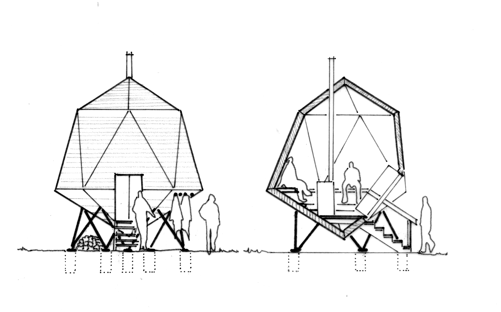

# OpenSource Sauna
Pläne und Dokumente für den Bau einer Sauna

# Ansatz
Wir wollen die Saunarisierung des Abendlandes! Denn die OpenSource Sauna strebt die Gesundheit von Körper und Geist an. Und zwar für alle. Jeder sollte kostengünstigen Zugang zu einer Sauna haben und diese regelmäßig besuchen. In der Gruppe ist dieses besonders zusammenschweißend. Daher die Idee einen Saunaverein zu gründen und eine passende Sauna dafür zu konstruieren.

# Zielsetzung
Das Ziel ist es die Unterlagen (Baupläne, Statik, Genehmigungsunterlagen, Kosten) zur Errichtung einer Sauna zu erarbeiten und als OpensSource Projekt zu veröffentlichen. Die Sauna ist von der Größe so gewählt, dass sie sich für eine Nutzung an einer Gruppe z.B. eines Vereins orientiert. Pilotprojekt hierfür ist der Bau des Saunavereinsgebäudes der "Sauna Schwestern+Brüder" in Bayern/Deutschland. Entsprechende Erfahrungen des Baus und dessen Dokumentation sollen hier veröffentlicht werden.

# Lösung
Hierfür werden Modellvarianten, die je nach Budget und Handwerklichen Fähigkeiten in unterschiedliche Bauweisen aufgegliedert. So soll eine Massivholzbauweise und eine Holzständerbauweise angeboten werden. Je nach Örtlichkeit wird auch die Fassade angepasst.

# Projektgliederung
Die Unterlagen werden soweit vorhanden hochgeladen. Für ausstehende Pläne werden entsprechende Projekte vorgegeben. Das Projekt gliedert sich wie folgt:
- Pläne für Genehmigungsplanung und Datenblätter 
- Werkpläne
- Details für Holz und Stahl 
- Statik
- Kostenberechnung
- Dokumentation (Fotos, Videos, Beschreibungen)
- Vereinsgründungsunterlagen

# Lizenz
Diese Arbeit ist lizensiert unter der Creative Commons .
